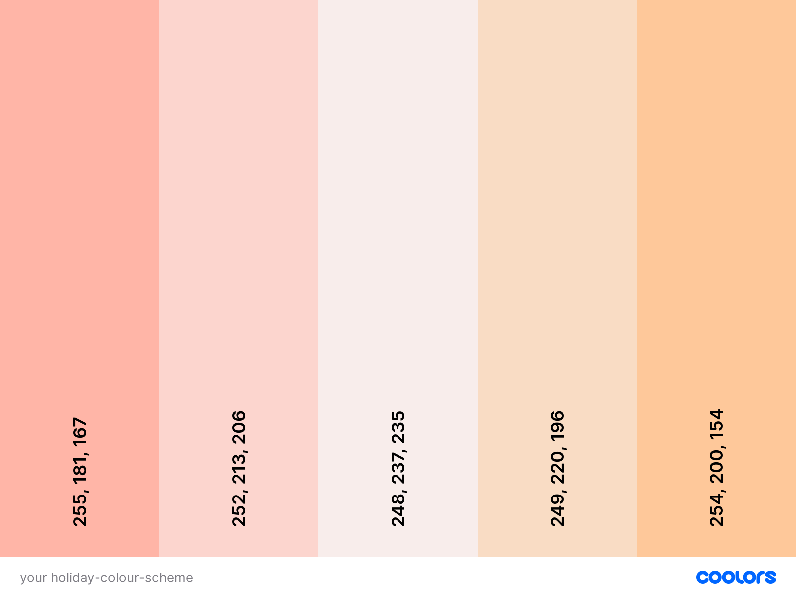

# YourHolidays 

## Contents 
---
  * [UX (User Experience)](#ux--user-experience-)
    + [Project Goals](#project-goals)
    + [User Goals](#user-goals)
    + [User Stories](#user-stories)
    + [Site Owner Goals](#site-owner-goals)
    + [User Requirements and Expectations](#user-requirements-and-expectations)
    + [Design Choices](#design-choices)
    + [Wireframing](#wireframing)
  * [Technologies Used](#technologies-used)
  * [Features](#features)
  * [Testing](#testing)
  * [Bugs](#bugs)
  * [Deployment](#deployment)
  * [References](#references)
    + [Code References](#code-references)
    + [Investment Information Sources](#investment-information-sources)
    + [Image Sources](#image-sources)
    + [Special Thanks](#special-thanks)

 ## UX (User Experience) 
 ---
 ### Project Goals 
 Create a site that allows users to plan their holiday destinations and explore difference choices.

 ### User Goals 
* Find interesting potential holiday destinations and explore the activities.
* Search for specific activities and tourist attractions of potential interest.
* Use it to help planning holiday where the destination has already been decided.

### User Stories 
* As a user, I want to explore different locations in the world to decide where to travel for a holiday.
* As a user, I want to be able to see the different attractions, restaurants, hotels and events available in any potential holiday destination to help me decide.
* As a user, I want to be able to easily search and find helpful information without too much hassle.
* As a user, I want to be able to get contact details and addresses of locations of interest for the sake of holiday planning. 

### Site Owner Goals
* Help users plan their holiday destinations after they have decided on it.
* Help users to explore a potential holiday destination and possible activities there.
* Help users navigate site without complication and difficulty, make the experiences as smooth as possible.

### User Requirements and Expectations 
**Requirements**
* Web application should be on the header part of front-page to dominate the webpage.
* Should be a one page website that has only web app on display to avoid distracting user from main feature.
* Should be without lag and have good performance to make experience comfortable and easy.

**Expectations**
* Visually appealing website that is easy on the eyes and make the UX very positive emotionally.
* Looks professional and the colour schemes should relax user as if they were on holiday.
* Satisfy all user goals to the best of ability by including all relevant features, user should feel site was very helpful.

### Design Choices 
---
**Fonts**

I looked for a simple and asthetically pleasing font to match typical holiday themes of relaxations and good times. I chose [Palanquin](https://fonts.google.com/specimen/Palanquin?category=Sans+Serif&sort=popularity&query=pa#standard-styles) for all texts and headers. 

**Colours**

I chose to use the [Coolors](https://coolors.co/ffb5a7-fcd5ce-f8edeb-f9dcc4-fec89a) colour scheme generator to find one suitable for this project. Below is a screenshot of the colour scheme. I have colours you would find in beaches, where many people usually take their holidays and associate with holidays. They are soft colours that are pleasant to look at and would relax the user.

## Technologies Used 
---
**Languages**

* [HTML](https://developer.mozilla.org/en-US/docs/Web/HTML)
* [CSS](https://developer.mozilla.org/en-US/docs/Web/CSS)
* [JavaScript](https://en.wikipedia.org/wiki/JavaScript)

**Tools & Libraries**

* [Bootstrap](https://getbootstrap.com/)
* [Google Fonts](https://fonts.google.com/)
* [Gitpod](https://gitpod.io/workspaces/)
* [JQuery](https://jquery.com/) 

## Features 
---

## Testing 
---

### Explore the world
**User Story: I want to explore different locations in the world to decide where to travel for a holiday.**
* **Plan** The user should be able to use the Google maps to change the location of the map, zoom in and zoom out to look at the different places. 
* **Implementation** Correctly use the Google Maps API by making HTTP requests without error.
* **Test** Three of my friends and myself will manually test scrolling through different locations in the map, zooming in and zooming out. Test different locations at different degrees of zoom. 
* **Results** 
* **Verdict** 

### Check out attractions, accommodations and activites
**User Story: As a user, I want to be able to see the different attractions, restaurants, hotels and events available in any potential holiday destination to help me decide.**
* **Plan** 
* **Implementation** 
* **Test** 
* **Results** 
* **Verdict** 

### Easy to use 
**User Story: I want to be able to easily search and find helpful information without too much hassle.**
* **Plan** 
* **Implementation** 
* **Test** 
* **Results** 
* **Verdict** 

### Get information for holiday planning
**User Story: I want to be able to get contact details and addresses of locations of interest for the sake of holiday planning.**
* **Plan** 
* **Implementation** 
* **Test** 
* **Results** 
* **Verdict** 